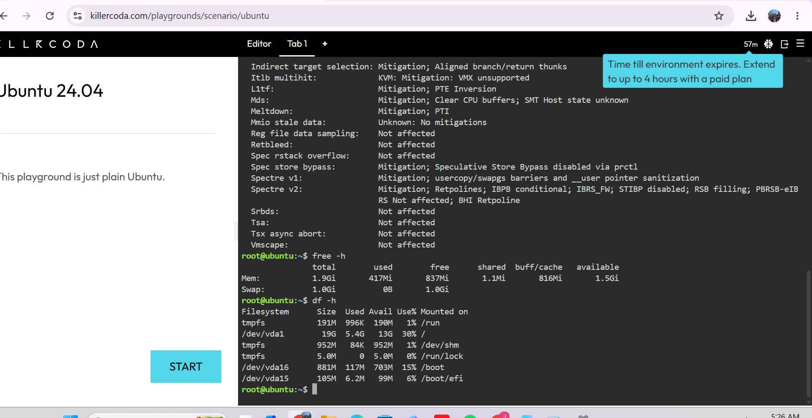

# Checkpoint 7 – Linux Investigation & Cloud Migration Analysis

## 1. System Investigation Details

* **Operating System:** Ubuntu 24.04 LTS (Noble Numbat) Linux x86_64 (`cat /etc/os-release`)
* **CPU Information:** x86_64 Virtualized Cloud CPU Core (`lscpu`)
* **Memory (RAM):** Total: 1.9 GiB | Used: 417 MiB | Available: 1.5 GiB (`free -h`)
* **Disk Space:** Root Filesystem (`/dev/vda1`): 19 GB Total, 5.4 GB Used, 13 GB Available (`df -h`)

---

## 2. Terminal Output Screenshot

---

## 3. Cloud Migration Strategy

**Question:** *If this Linux server were migrated to the cloud, which AWS, Azure, and GCP services could host it?*

* **Amazon Web Services (AWS):** **Amazon EC2 (Elastic Compute Cloud)**  
  * *Reason:* Offers resizable cloud compute capacity supporting Ubuntu 24.04 LTS images.
* **Microsoft Azure:** **Azure Virtual Machines**  
  * *Reason:* Provides flexible, on-demand Linux VM instances with active enterprise support.
* **Google Cloud Platform (GCP):** **Google Compute Engine (GCE)**  
  * *Reason:* Delivers high-performance Linux VMs on Google's infrastructure with custom machine types.  
