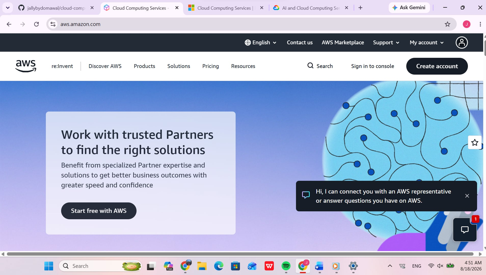

# Amazon Web Services (AWS) Research Report

## Overview
Amazon Web Services (AWS) is a comprehensive cloud computing platform provided by Amazon, offering over 200 fully featured services from data centers globally. Launched in 2006, AWS is widely recognized as a market leader in cloud infrastructure.

## Global Infrastructure
- **Regions:** 30+ geographic regions worldwide.
- **Availability Zones (AZs):** Multiple isolated data centers per region connected via low-latency networking.
- **Edge Locations:** Global content delivery network (CDN) points of presence for Amazon CloudFront.

## Cloud Management Console
The AWS Management Console provides a web-based interface for accessing, configuring, and managing AWS resources.

## Core Services
1. **Amazon EC2:** Elastic Virtual Machines for scalable compute capacity.
2. **Amazon S3:** Scalable object storage for data backup, archiving, and analytics
3. **Amazon RDS:** Managed relational database service supporting MySQL, PostgreSQL, and Aurora
4. **AWS IAM:** Identity and Access Management for secure user and resource access control

## Key Advantages
- **Market Maturity:** Broadest range of mature cloud services
- **Global Reach:** Extensive network of global regions and edge locations.
- **Scalability:** Auto-scaling features tailored for high-traffic applications

## Enterprise Use Cases
- Hosting global web applications
- Disaster recovery and enterprise data archiving
- Microservices deployment with container management
