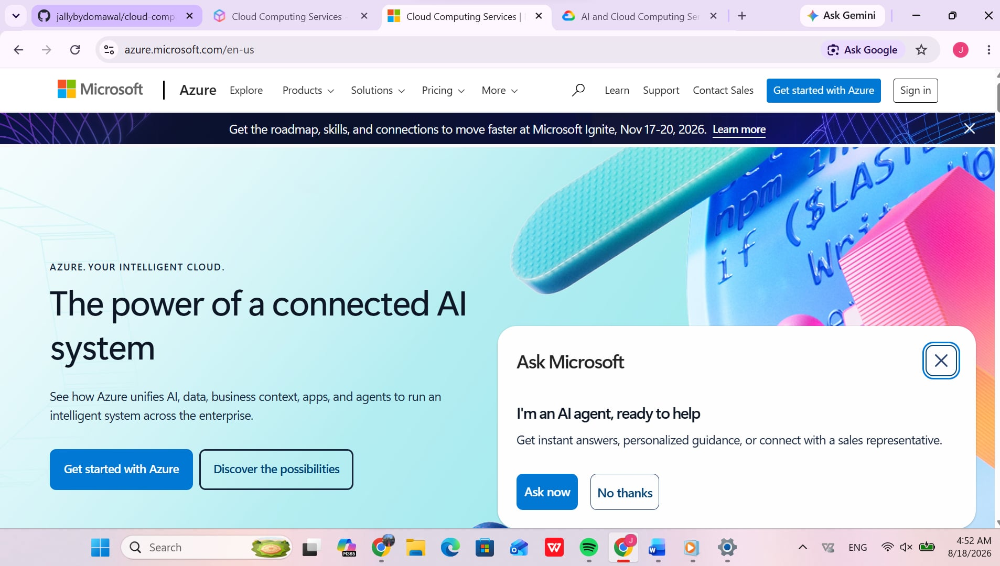

# Microsoft Azure Research Report

## Overview
Microsoft Azure is a cloud computing platform operated by Microsoft, offering services across compute, analytics, storage, and networking. Launched in 2010, Azure is widely adopted by enterprise organizations utilizing Microsoft infrastructure.

## Global Infrastructure
- **Regions:** More global regions than any other cloud provider.
- **Availability Zones:** Multi-datacenter locations within regions ensuring high availability.
- **Edge Network:** Integration with Microsoft's global fiber backbone.

## Cloud Management Console
The Azure Portal offers a customizable dashboard for monitoring, configuring, and managing enterprise services.

## Core Services
1. **Azure Virtual Machines:** Scalable compute instances running Linux or Windows Server.
2. **Azure Blob Storage:** Massively scalable object storage for unstructured data.
3. **Azure SQL Database:** Managed relational database powered by SQL Server.
4. **Microsoft Entra ID:** Identity management service providing single sign-on and directory access.

## Key Advantages
- **Microsoft Ecosystem Integration:** Seamless integration with Active Directory, Windows Server, and M365.
- **Hybrid Cloud Capabilities:** Azure Arc and Azure Stack support smooth hybrid deployments.
- **Enterprise Licensing:** Flexible cost structure for existing Microsoft software licenses.

## Enterprise Use Cases
- Enterprise active directory and identity management.
- Migration of legacy Windows infrastructure.
- Enterprise hybrid cloud deployments.
