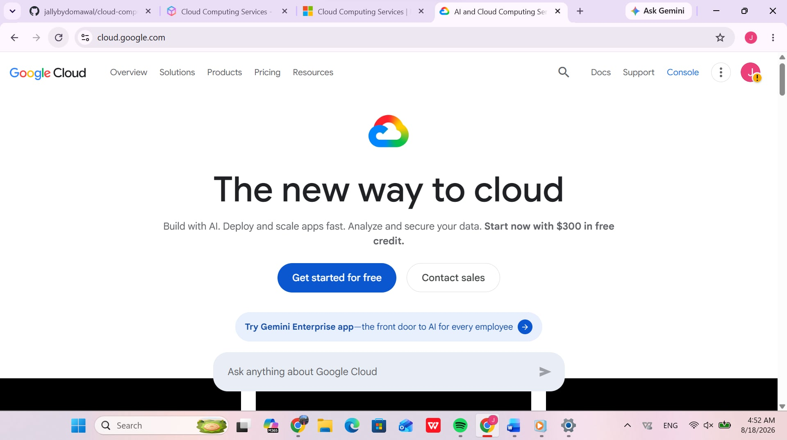

# Google Cloud Platform (GCP) Research Report

## Overview
Google Cloud Platform (GCP) is a suite of cloud computing services provided by Google, running on the same infrastructure that Google uses internally for products like Search and YouTube. Launched in 2008, GCP specializes in big data, machine learning, and container orchestration.

## Global Infrastructure
- **Regions & Zones:** Worldwide regions connected by Google's private global fiber network.
- **Network Architecture:** High-throughput, low-latency global private network.

## Cloud Management Console
The Google Cloud Console provides an intuitive web interface for managing cloud services, project resources, and APIs.

## Core Services
1. **Compute Engine:** High-performance virtual machine instances.
2. **Cloud Storage:** Unified object storage for web content, data lakes, and backups.
3. **Cloud SQL:** Fully managed relational database service for MySQL, PostgreSQL, and SQL Server.
4. **Google Kubernetes Engine (GKE):** Managed environment for deploying containerized applications.

## Key Advantages
- **AI/ML Leadership:** Custom Tensor Processing Units (TPUs) and Vertex AI platform.
- **Kubernetes Expertise:** Native origin and industry leadership in container management.
- **High-Performance Network:** Fast global network backbone.

## Enterprise Use Cases
- Machine learning model training and AI research.
- Big data processing and real-time data analytics.
- Containerized microservice deployments with GKE.
